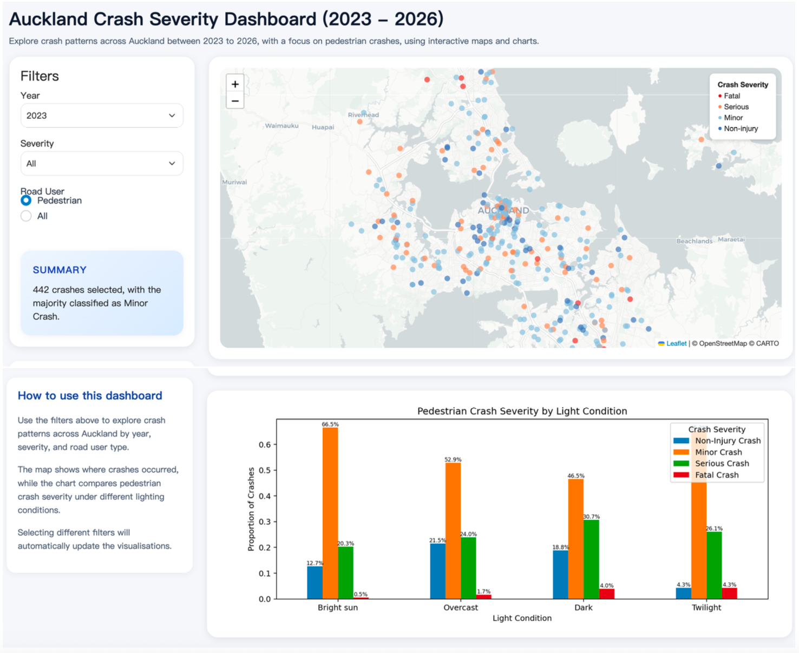
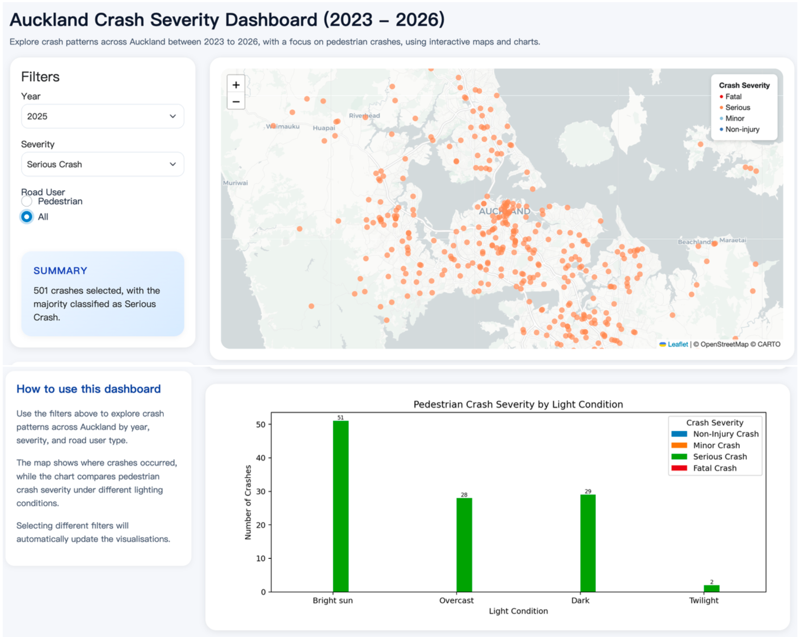
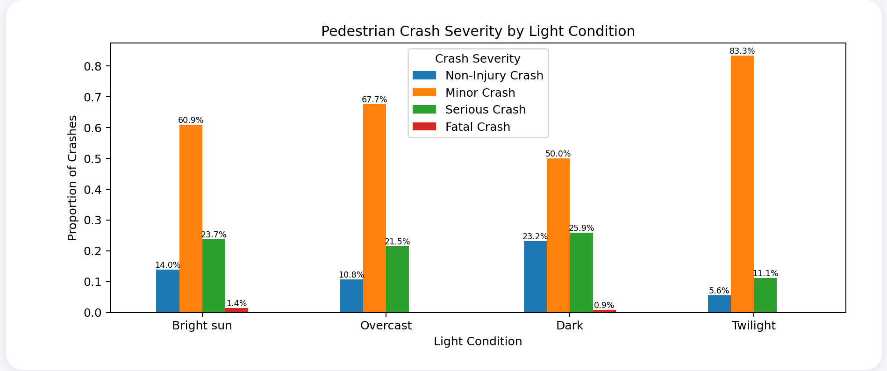

## Motivation and audience

Road safety is an important issue in urban environments, especially in growing cities where vehicles, pedestrians, and cyclists share the road network every day. This dashboard explores road crash patterns in Auckland from 2023 to 2026, with a focus on pedestrian crashes and crash severity under different lighting conditions. It helps users understand where crashes occur, how severe they are, and how lighting conditions may influence crash outcomes.

The dashboard is designed for a general audience interested in transport safety, including city planners, researchers, students, and members of the public. It provides an interactive way to explore crash data without requiring advanced GIS knowledge.

Users can filter crashes by year, severity, and road user type to explore spatial patterns and compare crash trends under different conditions. The interactive map shows where crashes occurred across Auckland, while the chart compares pedestrian crash severity under different lighting conditions. These insights may help support discussions about pedestrian safety and road safety awareness in Auckland.

## Data and preparation

This dashboard uses publicly available crash data from the New Zealand Crash Analysis System (CAS). The original dataset contains road crash records from across New Zealand, including information about crash location, crash severity, road users involved, and environmental conditions. For this project, only crash records from Auckland between 2023 and 2026 were selected for analysis.

To prepare the dataset for the dashboard, only the variables needed for the analysis were retained, including crash coordinates (X, Y), crash year, crash severity, pedestrian involvement, and light conditions. Missing light condition values were replaced with "Unknown", while missing pedestrian values were filled with 0 and converted to integer format.

The original crash coordinates were stored in NZTM (EPSG:2193). Since ipyleaflet requires coordinates in WGS84 (EPSG:4326), the coordinates were transformed using pyproj.Transformer. New longitude and latitude fields were then created for use in the interactive map.

One limitation of the dataset is that some records contain missing or unknown information, particularly for light conditions. In addition, the dashboard only focuses on a small number of variables and does not include other possible factors such as weather, traffic volume, or driver behaviour that may also influence crash severity.

## Technical architecture

The dashboard was developed using Shiny for Python and follows a reactive application structure. It is organised into three main parts: data preparation, user interface design, and server-side reactive logic. The crash dataset is cleaned before the dashboard loads, while the user interface defines the filter panel, summary section, interactive map, and chart outputs.

The dashboard contains three user inputs: year, crash severity, and road user type. These inputs are connected to a shared @reactive.calc function called filtered(), which filters the dataset based on the current selections. This improves efficiency because the filtering process only runs once whenever the inputs change.

The dashboard includes three main outputs: a dynamic text summary, an interactive map, and a bar chart. The summary reports the number of crashes matching the selected filters and identifies the most common crash severity category. The map displays crash locations as coloured point markers, while the chart compares pedestrian crash severity under different lighting conditions. All outputs automatically update when users change the filters.

Several Shiny rendering functions are used throughout the dashboard, including @render.text, @render.ui, and @render.plot. The original implementation used ipyleaflet together with @render_widget, following the assignment requirements. However, compatibility issues between ipyleaflet, shinylive, and Pyodide caused problems after deployment to GitHub Pages. To improve browser compatibility, the final implementation uses Leaflet.js rendered through a Shiny UI output. This alternative approach was approved by Hyesop Shin.

To improve performance, only the variables required for analysis were retained in the dataset. In addition, when the filtered dataset becomes very large, random sampling is used to limit the number of crash points displayed on the map and maintain responsive interaction.

## User interface walkthrough
### Dashboard Overview
When users first open the dashboard, they see the main title, filter panel, summary section, interactive map, and bar chart visualisation. The layout is designed to keep the controls on the left side and the visual outputs on the right side for easy navigation.

{width=65%}

### Filtering Crash Data
Users can filter the crash dataset by year, crash severity, and road user type using the controls in the left sidebar. Once a filter is changed, the summary, map, and chart automatically update to reflect the selected crash data. 
For example, when users select: Year = 2025, Severity = Serious Crash and Road User = All, the dashboard displays only serious crashes recorded in 2025. The map highlights where these crashes are concentrated across Auckland. The chart shows how serious pedestrian crashes vary under different lighting conditions. 

{width=65%}

### Comparing Crash Severity Under Different Lighting Conditions
The bar chart helps users compare pedestrian crash severity under different lighting conditions, including bright sun, overcast, dark, and twilight conditions.
For example, when users select: Year = 2025, Severity = All, Road User = Pedestrian, the chart shows that minor crashes make up the largest proportion of pedestrian crashes across all lighting conditions. Serious Crashes are also relatively common, particularly during dark conditions. In contrast, Fatal Crashes represent only a very small proportion of the total crashes.

{width=65%}

## Limitations and future improvements

Although the dashboard provides an interactive overview of crash patterns in Auckland, several limitations remain. The analysis only focuses on a small number of variables from the original crash dataset, including crash severity, pedestrian involvement, and lighting conditions. Other factors such as weather conditions, traffic volume, road type, and speed limits were not included and may also influence crash outcomes.

The dashboard only includes crashes recorded between 2023 and 2026, which limits longer-term trend analysis. In addition, some records contain missing or simplified information that may affect the accuracy of the visualisations. During deployment, compatibility limitations between ipyleaflet, shinylive, and Pyodide also required the interactive map implementation to be adjusted for browser stability.

Several improvements could be made in future versions of the dashboard. Additional variables such as weather, road surface conditions, or speed limits could support deeper analysis. More interactive features, including pop-up crash details, hotspot analysis, or improved mobile responsiveness, could also enhance the user experience.
